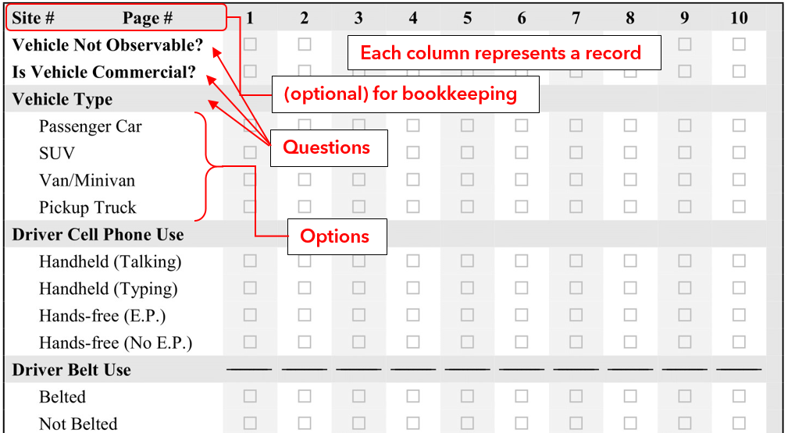
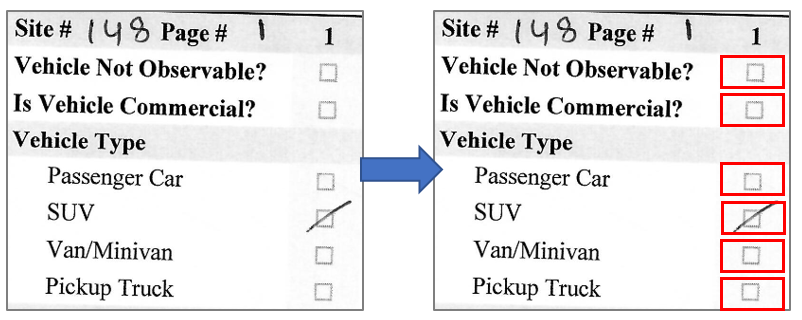

# Safety Belt Survey (SBS) OMR ScanScript

## About SBS
**Safety belt survey** (SBS) is a regular annual exercise conducted by the different state departments of transportation to check the drivers' compliance rate of safety belt usage. The surveyor randomly samples cars stopped at stop or signal-controlled intersections and peeks in the car from a distance, noting the characteristics of the driver and front-seat passenger on a paper form. These characteristics include seat belt usage, cell phone usage as well as estimated demographics (age group, sex, race). In most places, the observations are made manually on paper and then manually digitized.

## About ScanScript
This script uses **optical mark recognition** (OMR) on a custom prepared SBS form to automatically digitize the collected data. The single-page form is laid out in a grid as shown below (for the full form, see `img/blank-form.png`).

For each of the scanned copy of this specifically designed form, the script first perspective-transforms the outer box into a rectangle and performs basic adjustments. It then creates a grid in the region of the multiple-select boxes and identifies the cells (pixel rectangles) associated with each record, question, and option as shown below.

It then classifies each question into a response category based on the average darkness of these cells. The surveyor can choose any kind of mark (circle, filled circle, tick mark, scribble, etc.) as long as it is sufficiently dark above an empirically set threshold. For questions with multiple options, the option corresponding to the darkest cell gets classified.

## Instructions for use
**Requirements**: Python 3.x with `opencv-python`. Other packages: `glob`, `numpy`, `pandas`, `matplotlib`

Most of the parameters set in the main function are hardcoded empirically. It is important to maintain these settings for this script to work well.

For **each** survey site, do the following:
1. Batch scan the paper forms as per these settings (can be tweaked in the script):
    * Paper size: Letter
    * Scan resolution: 300 dpi
2. Create a folder, named appropriately, in `./test/` and store the scanned images in it.
3. Check if the images are alright (orientation, tilt, brightness/contrast, etc.).
    * **Important**: Make sure that there is no break in the black boundary of the outer box in the scanned image. If there is any, the algorithm cannot coerce the outer quadrilateral into a rectangle and the script runs with a warning and leaves all cells on that page unclassified. This gap must be manually filled to maintain continuity (e.g. editing in MS Paint or rescanning after drawing a straight line over it with a ruler and a narrow-pointed pen).
3. Run the main script `./sbs_omr.py` with the list of files to be scanned. The `main()` function demonstrates three ways of selecting the files: either a single file, a bunch of files (named sequentially), or the entire folder. You should also specify an output CSV file after you get the dataset.
4. If there is no error, you should see the output file in the path specified. Open that file and skim it to see if there are any obvious systematic errors (such as omission, wrong numbering, etc.). This should be easier than it sounds.
---
